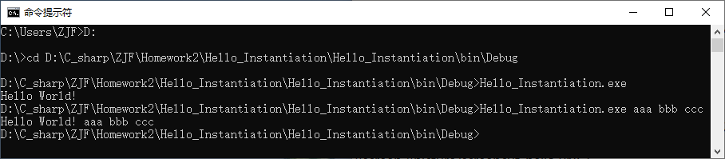
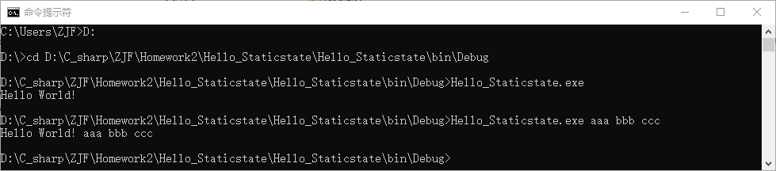
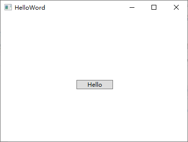
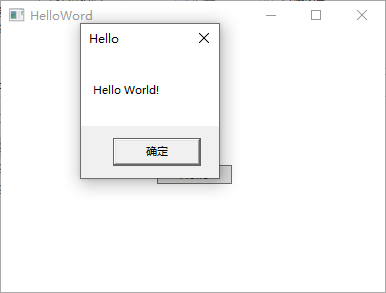
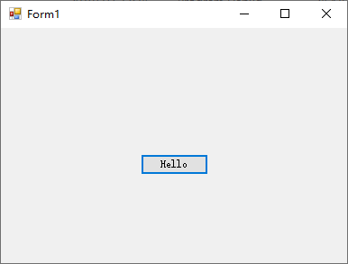
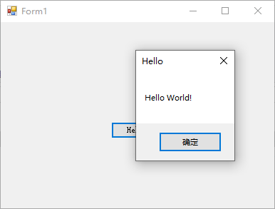
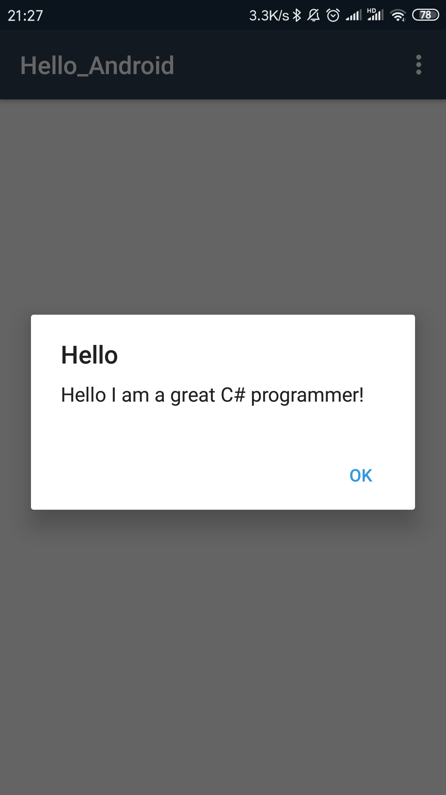

# Homework2

## 1. 创建新的类，实例化 HelloWorld
项目文件：Hello_Instantiation  
创建实例化Hello类，用Hello类的print方法输出一个Hello World，并输出传入的参数  
截图：  

## 2. 创建新的类，静态方法，无需实例化的 HelloWorld
项目文件：Hello_Staticstate  
创建静态Hello类，Hello.hello()输出一个Hello World，并输出传入的参数  
截图：  

## 3. WPF的HelloWorld
项目文件：Hello_WPF  
在窗体上创建按钮，在处理按钮消息的函数中用MessageBox.Show()输出Hello World  
截图：  

## 4. WindowsForm中创建新类的 HelloWorld
项目文件：Hello_Forms  
在窗体上创建按钮，在处理按钮消息的函数中用MessageBox.Show()输出Hello World  
截图：  

## 5. Xamarin Android HelloWorld
项目文件：Hello_Android  
在窗体上创建按钮，点击按钮时弹出弹窗显示"Hello I am a great C# programmer!"  
截图：  

